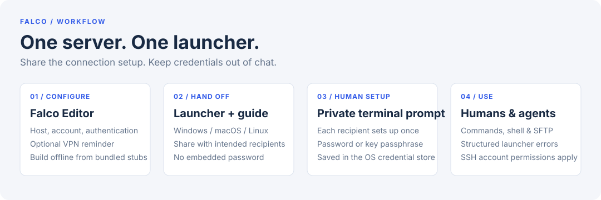

# Falco

**Give your AI agent a server command. Hand your colleague a ready-to-run SSH launcher.**

Falco packages one server's SSH connection into a portable executable for
Windows, macOS or Linux, plus a `how-to-use.md` guide for humans and agents.
No separate SSH installation or config file required. Each recipient privately
sets up their credentials once in a terminal; agents then run commands and
transfer files without asking for passwords in chat.

[Download the Editor](https://github.com/qarasky/falco/releases) ·
[Quick start](#create-a-launcher) · [Security & threat model](#security--threat-model)



### Why not just `ssh`?

If everyone already has SSH configured, keep using it. Falco is for handing off
**a configured tool rather than a setup checklist**:

- **For agents:** one executable and a generated guide, JSON diagnostics, host-key
  checks, and credentials retrieved from the OS store instead of supplied in chat.
- **For colleagues:** share a launcher and guide; they complete private terminal
  setup once, then open a shell or run commands with the same tool.
- **For mixed-platform teams:** one editor can produce launchers for all bundled
  platforms, offline, without installing a compiler on the recipient's machine.

```sh
# After the human completes first-run credential setup:
./server-client-X "docker ps"
./server-client-X --upload ./app.zip /srv/app.zip
```

Falco is not an access-control boundary or a restricted agent sandbox. Commands
have the configured SSH account's permissions. First-run setup and OS security
prompts mean this is not a zero-click onboarding promise.

## Create a launcher

Enter the host, port and SSH username, then choose authentication:

- **Password:** the launcher contains no password.
- **Encrypted key:** select a passphrase-protected **OpenSSH private key**. The
  encrypted key is embedded in the launcher; its passphrase is not. Unencrypted
  keys, PEM/PKCS#8 keys and signed SSH user certificates are not supported.
  Use `ssh-keygen` to save a compatible encrypted OpenSSH key if needed.

Check **Requires Tailscale / WireGuard / VPN** when the server is on a private
network. Falco adds a reminder to the generated agent instructions and connection
errors. Choose this computer or all available bundled platforms, an output name,
and an output folder. The editor confirms replacements and produces launchers
plus `how-to-use.md` with their actual filenames.

Builds require no compiler or network connection: the editor stamps configuration
into prebuilt Rust launcher files. New editors reject outdated launcher files
rather than silently generating an executable that ignores key/VPN settings.

## First use — human setup

Run the launcher once in a terminal. The user privately enters the server
password or private-key passphrase in a hidden prompt. After the server accepts
it, Falco saves it in Windows Credential Manager, macOS Keychain, or Linux Secret
Service. Each recipient sets up their own credentials on their own machine.

Subsequent runs retrieve the secret privately. Falco never accepts passwords or
passphrases through argv or environment variables, or writes decrypted keys to
files. Secrets exist in process memory while needed; Falco cannot prevent access
by software with unrestricted OS-account permissions or control external dumps.
Agents must never ask for credentials in chat. If unattended setup is missing,
`CREDENTIAL_SETUP_REQUIRED` tells the agent to ask the user to run terminal setup.

On macOS/Linux, copied launchers may need `chmod +x <filename>`. Unsigned macOS
files may require right-click → Open or removal of the quarantine attribute;
the generated guide explains the relevant filename.

## Commands and files

For a Unix launcher named `server-client-X` (Windows uses its `.exe` directly):

```sh
./server-client-X "docker ps"
./server-client-X docker ps
./server-client-X --stdin deploy.sh
./server-client-X                       # interactive terminal
./server-client-X --upload ./app.zip /srv/app.zip
./server-client-X --download /var/log/app.log ./app.log
./server-client-X --upload-dir ./dist /var/www
./server-client-X --download-dir /var/log ./logs
./server-client-X --list /srv
```

Other SFTP actions are `--mkdir`, `--remove`, and `--move`. Add `--overwrite` to
replace existing destinations and `--mkdirs` to create missing parents.
Commands execute on the server; remote stdout/stderr stream unchanged and the
launcher returns the actual command exit status. Missing exit status and remote
signals produce explicit failures. Falco never automatically retries a command.

## Host identity

Falco remembers the first observed host-key fingerprint per host and port in the
OS credential store (**trust on first use**). Subsequent changed keys are rejected
before credentials are sent. The first connection still requires a trusted
network or independent server-identity verification.

A changed key reports `HOST_KEY_CHANGED`, expected/observed fingerprints, and:
“Server key changed. If you accept this change, retry with --accept-new-key.”
Verify the new fingerprint with the server administrator first. AI agents must
get the user's authorization before accepting a changed key. Then retry:

```sh
./server-client-X --accept-new-key "docker ps"
```

This updates the stored pin; it does not disable future checks.
`--reset-credential` clears the active password/passphrase and starts private
terminal setup again. `--reset-password` remains an alias. Credential reset does
not erase host trust. Keystore failures never fall back to insecure storage.

## Security & threat model

**Designed to keep passwords and passphrases out of shared launchers, command
arguments and agent chat—not to hide them from a compromised machine.**

- **What you distribute:** the executable includes the host, port, username and,
  in key mode, the encrypted OpenSSH private key. These bytes are extractable;
  encryption is not a reason to publish a launcher containing a private key.
  Anyone with a copy can attempt offline passphrase guessing. Use a strong,
  unique passphrase and a dedicated, least-privilege key, not a personal master key.
- **Sharing is sharing an identity:** recipients of a key-mode launcher use the
  same embedded SSH key. Separate local credential stores do not create separate
  server identities. Prefer individual accounts/keys for attribution and
  revocation, and distribute key-mode launchers only to intended key holders.
  If a launcher or passphrase leaks, revoke the key on the server; deleting a
  local credential does not revoke access or erase distributed copies.
- **Local trust:** secrets are stored in the native OS credential store and used
  in process memory. Malware, an unrestricted same-account agent, administrator
  access or external memory/crash dumps are outside this protection. After setup,
  an agent that can run the launcher can exercise the SSH account's permissions.
- **Server trust:** host keys use trust on first use, not independently verified
  identity on the first connection. Use a trusted network and verify the server
  fingerprint independently before relying on the first pin. Changed keys fail
  closed; approve replacements only after verification.
- **Executable trust and macOS:** current distribution is unsigned; do not assume
  code signing or notarization. Only run editors and launchers from a source you
  trust, or build from reviewed source. macOS may block downloaded files, and
  copied Unix launchers may need `chmod +x`. Remove quarantine only after checking
  provenance—it bypasses an OS safeguard, not a Falco security check.

For sensitive deployments, enforce permissions and command restrictions on the
server. Falco does not add per-command approval, isolation, or automatic rollback.

## Errors for AI agents

Falco's own errors are one JSON object per line on stderr:

```json
{"error":"CONNECTION_TIMEOUT","message":"Timed out connecting to the configured SSH server.","action":"Check the host/IP, SSH port, server availability and required VPN.","target":"deploy@100.64.0.12:22"}
```

Codes distinguish DNS lookup failure, refused/unreachable connections, connection
and SSH-handshake/authentication timeouts, rejected credentials, key decryption,
unavailable credential stores, host-key changes, and remote-operation failures.
Messages explain known facts and give a next action. A timeout does not establish
that a password is wrong or that the user is “not logged in.” When VPN is marked
required, ask the user whether Tailscale/WireGuard/VPN is enabled before changing
addresses or retrying. Inspect possible partial effects before retrying remote
commands or transfers.

Launcher error exit groups are `2` (arguments/config), `3` (local credentials),
and `4` (SSH/remote operations). Remote commands return their own exit codes, so
use a Falco JSON diagnostic to distinguish a launcher failure from remote stderr.

## Build and develop

Download the Editor from [Releases](https://github.com/qarasky/falco/releases),
or build from source with Python 3.12+ (including Tk) and Rust 1.85+:

```sh
cd launcher-rs
cargo build --locked --release
cd ..
python -m pip install -e ".[build,dev]"
python build/build_editor.py --out-dir dist
```

A local build bundles the current OS's launcher. Release builds bundle Windows,
macOS and Linux launchers into every editor. Old generated launchers must be
rebuilt to receive host verification, key authentication and the new diagnostics.

The headless builder also supports the new settings:

```sh
python build/build_launcher.py --name server-client-X --host 100.64.0.12 \
  --user deploy --output server-client-X --out-dir dist \
  --private-key ~/.ssh/id_ed25519 --requires-vpn
```

Omit `--private-key` for password authentication; use `--all-platforms` to build
all available targets. The CLI intentionally replaces named output files; the
GUI asks first. Each file replacement is atomic, but replacing multiple platform
files is not a single filesystem transaction. Errors identify any files already
replaced. Release publication waits for Python and Rust checks on all three OSes.

```sh
python -m pytest
cargo test --locked --manifest-path launcher-rs/Cargo.toml
cargo fmt --manifest-path launcher-rs/Cargo.toml --check
cargo clippy --locked --manifest-path launcher-rs/Cargo.toml --all-targets -- -D warnings
```

`editor/` holds the Tk interface and assembly logic; `shared/` validates embedded
configuration; `launcher-rs/` implements SSH/SFTP, host trust, credentials and
structured diagnostics.

## License

MIT.
