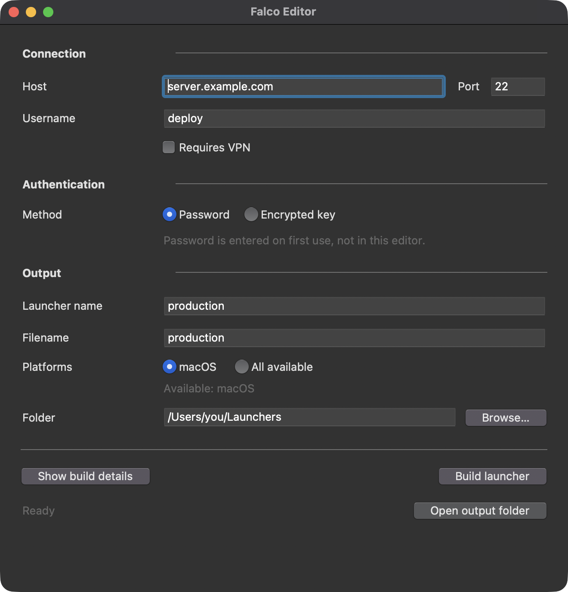

<p align="center">
  
</p>

<h1 align="center">Falco</h1>

[](https://github.com/qarasky/falco/releases/latest)  

**One launcher per server. Safe to commit in password mode. Works for you and your AI agent.**

<!-- Add the real demo GIF here when ready, directly below the tagline. -->

Falco packages one server's SSH connection into a portable executable for
Windows, macOS or Linux, plus a `how-to-use.md` guide for humans and agents.
No separate SSH installation or config file required. Each recipient privately
sets up their credentials once in a terminal; agents then run commands and
transfer files without asking for passwords in chat.

Or just double-click it to open a shell on the server, where your OS supports
terminal launching, after first-run setup.

[Download the Editor](https://github.com/qarasky/falco/releases) ·
[Quick start](#quickstart) · [What's safe to commit](#whats-safe-to-commit)

<p align="center">
  
</p>

## Why

You manage many servers and want one ready-to-run tool for each.
You're tired of copying your AI agent's commands into terminals and pasting results back.
You want a free tool with no SSH client or MCP service to install and configure.
Create a launcher, save your password once, and let you or your agent use it.

## Quickstart

1. **Download the [Editor](https://github.com/qarasky/falco/releases)** for your OS.
   On macOS, open `Falco-Editor-mac.dmg` and drag `Falco Editor.app`
   to Applications (or double-click it to run).
2. **Create a launcher:** enter the host, port and username, leave **Password**
   selected, choose an output folder, and click **Build launcher**.
3. **Run the launcher once in a terminal** and enter your password privately.
   After successful authentication, it is saved in your OS credential store.

Then give your agent the launcher and its generated `how-to-use.md`, or share them
with a colleague who completes their own first-run setup.

```sh
# After the human completes first-run credential setup:
./server-client-X "docker ps"
./server-client-X --upload ./app.zip /srv/app.zip
```

## Why not just SSH?

Plain `ssh` is great if you already have it configured. Falco came from managing
many client servers: instead of copying AI-generated commands into terminals,
keep a password-mode launcher in each project's repo and let the agent run it
directly. The connection travels with the project; your password stays local.

## Why not MCP?

Falco is a single executable, with no MCP server process or agent-specific setup.
It works with any agent that can run a shell command. Configure the connection
once in the Editor and complete private first-run credential setup; there's no
separate SSH client or integration to install.

## What's safe to commit

**A password-mode launcher is safe to commit from a credential perspective:**
its connection settings contain only the host, port and username, not a password.
It also contains non-secret metadata such as its name and VPN reminder.
**A public repo reveals your server's IP or hostname, port and username**, so
commit the launcher and guide only if those details are okay to disclose.

Passwords live in Windows Credential Manager, macOS Keychain or Linux Secret
Service after setup—not in the repository or executable. Falco never accepts them
through argv or environment variables. Enter them only in the private terminal
prompt, never in agent chat. **This commit-safety claim does not apply to optional
encrypted-key launchers**, which embed a private key.

## Create a launcher

Enter the host, port and SSH username. **Password is the default**; no password
is entered in the Editor or embedded in the launcher.

Check **Requires VPN** when the server is on a private
network. Falco adds a reminder to the generated agent instructions and connection
errors. Choose this computer or all available bundled platforms, an output name,
and an output folder. The editor confirms replacements and produces launchers
plus `how-to-use.md` with their actual filenames.

Builds require no compiler or network connection: the editor stamps configuration
into prebuilt Rust launcher files. New editors reject outdated launcher files
rather than silently generating an executable that ignores key/VPN settings.

## First use — human setup

Run the launcher once in a terminal. The user privately enters the server
password or private-key passphrase in a hidden prompt. After the server accepts
it, Falco saves it in Windows Credential Manager, macOS Keychain, or Linux Secret
Service. Each recipient sets up their own credentials on their own machine.

Subsequent runs retrieve the secret privately. Falco never accepts passwords or
passphrases through argv or environment variables, or writes decrypted keys to
files. Secrets exist in process memory while needed; Falco cannot prevent access
by software with unrestricted OS-account permissions or control external dumps.
Agents must never ask for credentials in chat. If unattended setup is missing,
`CREDENTIAL_SETUP_REQUIRED` tells the agent to ask the user to run terminal setup.

On macOS/Linux, copied launchers may need `chmod +x <filename>`. Unsigned macOS
files may require right-click → Open or removal of the quarantine attribute;
the generated guide explains the relevant filename.

## Commands and files

For a Unix launcher named `server-client-X` (Windows uses its `.exe` directly):

```sh
./server-client-X "docker ps"
./server-client-X docker ps
./server-client-X --stdin deploy.sh
./server-client-X                       # interactive terminal
./server-client-X --upload ./app.zip /srv/app.zip
./server-client-X --download /var/log/app.log ./app.log
./server-client-X --upload-dir ./dist /var/www
./server-client-X --download-dir /var/log ./logs
./server-client-X --list /srv
```

Other SFTP actions are `--mkdir`, `--remove`, and `--move`. Add `--overwrite` to
replace existing destinations and `--mkdirs` to create missing parents.
Commands execute on the server; remote stdout/stderr stream unchanged and the
launcher returns the actual command exit status. Missing exit status and remote
signals produce explicit failures. Falco never automatically retries a command.

## Host identity

Falco remembers the first observed host-key fingerprint per host and port in the
OS credential store (**trust on first use**). Subsequent changed keys are rejected
before credentials are sent. The first connection still requires a trusted
network or independent server-identity verification.

A changed key reports `HOST_KEY_CHANGED`, expected/observed fingerprints, and:
“Server key changed. If you accept this change, retry with --accept-new-key.”
Verify the new fingerprint with the server administrator first. AI agents must
get the user's authorization before accepting a changed key. Then retry:

```sh
./server-client-X --accept-new-key "docker ps"
```

This updates the stored pin; it does not disable future checks.
`--reset-credential` clears the active password/passphrase and starts private
terminal setup again. `--reset-password` remains an alias. Credential reset does
not erase host trust. Keystore failures never fall back to insecure storage.

## Security & threat model

- **Protects against accidental secret sharing:** passwords/passphrases are not
  embedded, accepted via argv/env, or written to temporary files. The OS store
  is used without an insecure storage fallback.
- **Rejects changed server identities:** pinned host keys are checked before
  authentication. **First connection is TOFU**, not independent verification;
  use a trusted network and verify the fingerprint independently.
- **Does not protect a compromised machine:** secrets exist in process memory.
  Malware, administrator access, unrestricted same-account agents and external
  memory/crash dumps are outside this protection.
- **Does not sandbox agents:** anyone able to run a configured launcher after
  setup can exercise the SSH account's permissions. Enforce least privilege and
  command restrictions on the server; Falco adds no per-command approval or rollback.
- **Does not establish executable provenance:** distribution is unsigned. Only
  run trusted editors/launchers or build from reviewed source. On macOS, remove
  quarantine only after checking provenance; this bypasses an OS safeguard.

## Optional: encrypted-key authentication

Select **Encrypted key** instead of Password and choose a passphrase-protected
**OpenSSH private key**. Unencrypted keys, PEM/PKCS#8 keys and signed SSH user
certificates are not supported.

**Warning: the encrypted private key is embedded in the launcher and can be
extracted. If you put it in a public repository, anyone can attempt offline
passphrase guessing. Use a strong, unique passphrase—but prefer keeping key-mode
launchers private, even with a strong passphrase.** Use a dedicated least-privilege
key, not your personal master key. The passphrase is saved locally after successful
authentication, never embedded.

Recipients of the same key-mode launcher share a server-side identity; separate
local credential stores do not change that. Prefer individual accounts/keys for
attribution and revocation. If a key or passphrase leaks, revoke the key on the
server: resetting a local credential cannot revoke access or erase shared copies.

## Errors for AI agents

Launcher failures produce JSON diagnostics on stderr with suggested next actions.
See [agent diagnostics and exit codes](docs/agent-errors.md) for details.

## Build and develop

Download the Editor from [Releases](https://github.com/qarasky/falco/releases),
or build from source with Python 3.12+ (including Tk) and Rust 1.85+:

```sh
cd launcher-rs
cargo build --locked --release
cd ..
python -m pip install -e ".[build,dev]"
python build/build_editor.py --out-dir dist
```

A local build bundles the current OS's launcher. Release builds bundle Windows,
macOS and Linux launchers into every editor. Old generated launchers must be
rebuilt to receive host verification, key authentication and the new diagnostics.

The headless builder also supports the new settings:

```sh
python build/build_launcher.py --name server-client-X --host 100.64.0.12 \
  --user deploy --output server-client-X --out-dir dist \
  --private-key ~/.ssh/id_ed25519 --requires-vpn
```

Omit `--private-key` for password authentication; use `--all-platforms` to build
all available targets. The CLI intentionally replaces named output files; the
GUI asks first. Each file replacement is atomic, but replacing multiple platform
files is not a single filesystem transaction. Errors identify any files already
replaced. Release publication waits for Python and Rust checks on all three OSes.

```sh
python -m pytest
cargo test --locked --manifest-path launcher-rs/Cargo.toml
cargo fmt --manifest-path launcher-rs/Cargo.toml --check
cargo clippy --locked --manifest-path launcher-rs/Cargo.toml --all-targets -- -D warnings
```

`editor/` holds the Tk interface and assembly logic; `shared/` validates embedded
configuration; `launcher-rs/` implements SSH/SFTP, host trust, credentials and
structured diagnostics.

The original app icon lives in `editor/assets/falco.svg`. After editing its
polygon shapes, run `python build/generate_icon.py` to regenerate the PNG,
Windows ICO and macOS ICNS assets (requires Pillow from the build extras).

## License

MIT.
